# B+ Tree Structure and Operations

## B+ Tree Node
```
+---------------------+
| BPlusTreeNode       |
+---------------------+
| - leaf: bool        |
| - keys: list        |
| - children: list    |
+---------------------+
| + insert_non_full() |
| + split_child()     |
+---------------------+
```

## B+ Tree
```
+---------------------+
| BPlusTree           |
+---------------------+
| - root: BPlusTreeNode |
| - t: int            |
+---------------------+
| + insert()          |
| + search()          |
+---------------------+
```

## Example Usage

### Initial State
```
Root: []
```

### Insert 10
```
Root: [10]
```

### Insert 20
```
Root: [10, 20]
```

### Insert 5
```
Root: [5, 10, 20]
```

### Insert 6
```
Root: [5, 6, 10, 20]
```

### Insert 12 (Split occurs)
```
Root: [10]
       /  \
  [5, 6]  [12, 20]
```

### Insert 30
```
Root: [10]
       /  \
  [5, 6]  [12, 20, 30]
```

### Insert 7
```
Root: [10]
       /  \
  [5, 6, 7]  [12, 20, 30]
```

### Insert 17 (Split occurs)
```
Root: [10, 20]
       /   |   \
  [5, 6, 7] [12, 17] [30]
```

### Search Operations
- `search(6)` returns [`True`]
- `search(15)` returns [`False`]

## Diagram

```mermaid
graph TD
    A[Start] --> B[Create BPlusTree with t=3]
    B --> C[Insert 10]
    C --> D{Is root full?}
    D -->|No| E[Insert 10 into root]
    E --> F[Insert 20]
    F --> G{Is root full?}
    G -->|No| H[Insert 20 into root]
    H --> I[Insert 5]
    I --> J{Is root full?}
    J -->|No| K[Insert 5 into root]
    K --> L[Insert 6]
    L --> M{Is root full?}
    M -->|No| N[Insert 6 into root]
    N --> O[Insert 12]
    O --> P{Is root full?}
    P -->|No| Q[Insert 12 into root]
    Q --> R[Insert 30]
    R --> S{Is root full?}
    S -->|No| T[Insert 30 into root]
    T --> U[Insert 7]
    U --> V{Is root full?}
    V -->|No| W[Insert 7 into root]
    W --> X[Insert 17]
    X --> Y{Is root full?}
    Y -->|No| Z[Insert 17 into root]
    Z --> AA[Search 6]
    AA --> AB{Is 6 in root?}
    AB -->|Yes| AC[Return True]
    Z --> AD[Search 15]
    AD --> AE{Is 15 in root?}
    AE -->|No| AF{Is root a leaf?}
    AF -->|No| AG[Search 15 in appropriate child]
    AG --> AH{Is 15 in child?}
    AH -->|No| AI{Is child a leaf?}
    AI -->|Yes| AJ[Return False]
    AJ --> AK[End]
```
