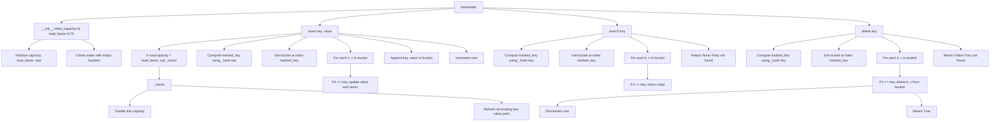

### Step-by-Step Drawing

1. **Initialization**
    - Create an instance of [`HashIndex`] with an initial capacity of 8 and a load factor of 0.75.
    - Initialize the [`index`] with 8 empty buckets.

2. **Insert 'key1' with 'value1'**
    - Compute the hash of 'key1' and determine the bucket index.
    - Insert ('key1', 'value1') into the appropriate bucket.
    - Increment the size of the hash table.

3. **Insert 'key2' with 'value2'**
    - Compute the hash of 'key2' and determine the bucket index.
    - Insert ('key2', 'value2') into the appropriate bucket.
    - Increment the size of the hash table.

4. **Search for 'key1'**
    - Compute the hash of 'key1' and determine the bucket index.
    - Search the bucket for 'key1' and return 'value1'.

5. **Search for 'key2'**
    - Compute the hash of 'key2' and determine the bucket index.
    - Search the bucket for 'key2' and return 'value2'.

6. **Delete 'key1'**
    - Compute the hash of 'key1' and determine the bucket index.
    - Search the bucket for 'key1' and remove it.
    - Decrement the size of the hash table.

7. **Search for 'key1' after deletion**
    - Compute the hash of 'key1' and determine the bucket index.
    - Search the bucket for 'key1' and return [`None`] since it has been deleted.

### Example Diagrams

#### Initialization
```plaintext
HashIndex
+-------------------+
| capacity: 8       |
| load_factor: 0.75 |
| size: 0           |
| index: [[], [], [], [], [], [], [], []] |
+-------------------+
```

#### Insert 'key1' with 'value1'
```plaintext
HashIndex
+-------------------+
| capacity: 8       |
| load_factor: 0.75 |
| size: 1           |
| index: [[('key1', 'value1')], [], [], [], [], [], [], []] |
+-------------------+
```

#### Insert 'key2' with 'value2'
```plaintext
HashIndex
+-------------------+
| capacity: 8       |
| load_factor: 0.75 |
| size: 2           |
| index: ('key1', 'value1')], [], [], [], [('key2', 'value2')], [], [], []] |
+-------------------+
```

#### Search for 'key1'
```plaintext
Search 'key1'
+-------------------+
| Hash: 0           |
| Bucket: [('key1', 'value1')] |
| Result: 'value1'  |
+-------------------+
```

#### Search for 'key2'
```plaintext
Search 'key2'
+-------------------+
| Hash: 4           |
| Bucket: [('key2', 'value2')] |
| Result: 'value2'  |
+-------------------+
```

#### Delete 'key1'
```plaintext
Delete 'key1'
+-------------------+
| Hash: 0           |
| Bucket: []        |
| Result: True      |
+-------------------+
```

#### Search for 'key1' after deletion
```plaintext
Search 'key1'
+-------------------+
| Hash: 0           |
| Bucket: []        |
| Result: None      |
+-------------------+
```
## Diagram
