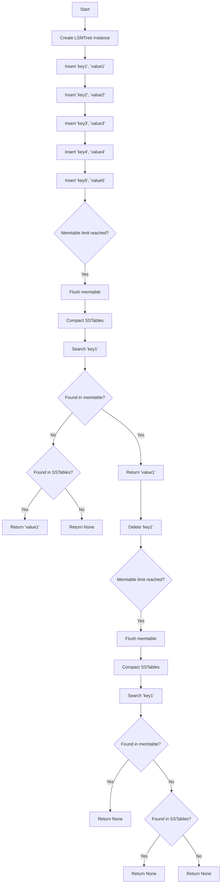

# LSM Tree

### Execution Flow of [`LSMTree`] Class

1. **Initialization**
    ```python
    lsm_tree = LSMTree()
    ```
    - An instance of [`LSMTree`] is created.
    - The [`__init__`] method initializes [`memtable`] as an empty dictionary, [`sstables`] as an empty list, and [`memtable_limit`] to 5.

2. **Inserting Key-Value Pairs**
    ```python
    lsm_tree.insert('key1', 'value1')
    lsm_tree.insert('key2', 'value2')
    lsm_tree.insert('key3', 'value3')
    lsm_tree.insert('key4', 'value4')
    lsm_tree.insert('key5', 'value5')  # This will trigger a flush
    ```
    - Each [`insert`] call adds a key-value pair to the [`memtable`].
    - When the [`memtable`] reaches the [`memtable_limit`] (5 entries), the [`flush_memtable`] method is called.

3. **Flushing Memtable**
    ```python
    def flush_memtable(self):
        self.sstables.append(self.memtable)
        self.memtable = {}
        self.compact_sstables()
    ```
    - The [`flush_memtable`] method moves the current [`memtable`] to the [`sstables`] list.
    - The [`memtable`] is then cleared.
    - The [`compact_sstables`] method is called to merge SSTables if necessary.

4. **Compacting SSTables**
    ```python
    def compact_sstables(self):
        if len(self.sstables) > 1:
            merged_sstable = {}
            for sstable in self.sstables:
                merged_sstable.update(sstable)
            self.sstables = [merged_sstable]
    ```
    - The [`compact_sstables`] method merges all SSTables into a single SSTable if there is more than one SSTable.

5. **Searching for a Key**
    ```python
    print(lsm_tree.search('key1'))  # Output: value1
    ```
    - The [`search`] method first looks for the key in the [`memtable`].
    - If not found, it searches through the SSTables in reverse order (most recent first).
    - Returns the value if found, otherwise returns [`None`].

6. **Deleting a Key**
    ```python
    lsm_tree.delete('key1')
    ```
    - The [`delete`] method marks the key as deleted by setting its value to [`None`] in the [`memtable`].
    - If the [`memtable`] reaches its limit, it triggers a flush.

7. **Searching for a Deleted Key**
    ```python
    print(lsm_tree.search('key1'))  # Output: None
    ```
    - The [`search`] method will not find the key in the [`memtable`] or SSTables, returning [`None`].

### Example Usage
```python
# Example usage
lsm_tree = LSMTree()
lsm_tree.insert('key1', 'value1')
lsm_tree.insert('key2', 'value2')
lsm_tree.insert('key3', 'value3')
lsm_tree.insert('key4', 'value4')
lsm_tree.insert('key5', 'value5')  # This will trigger a flush
print(lsm_tree.search('key1'))  # Output: value1
lsm_tree.delete('key1')
print(lsm_tree.search('key1'))  # Output: None
```

## Diagram
